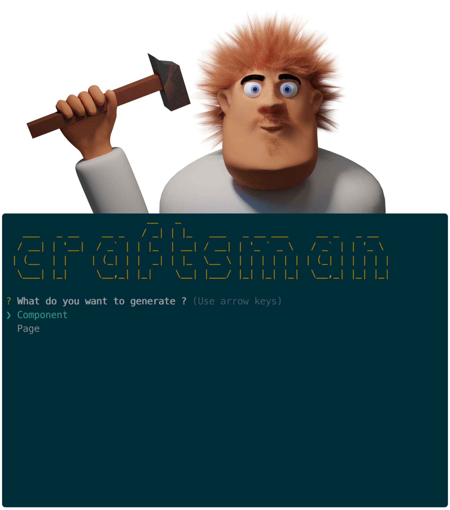
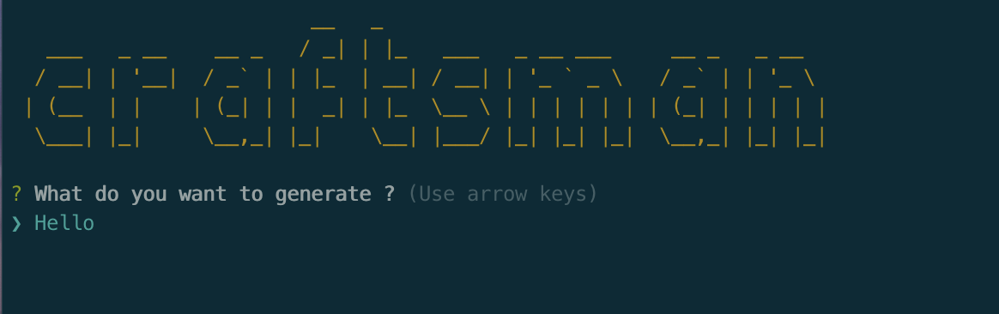
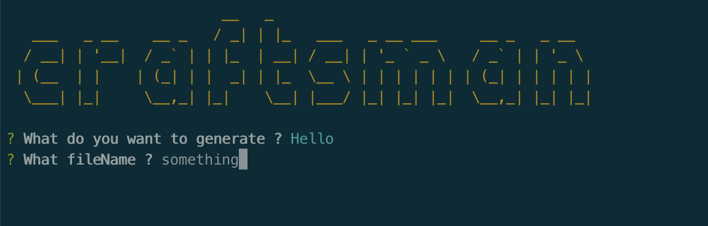
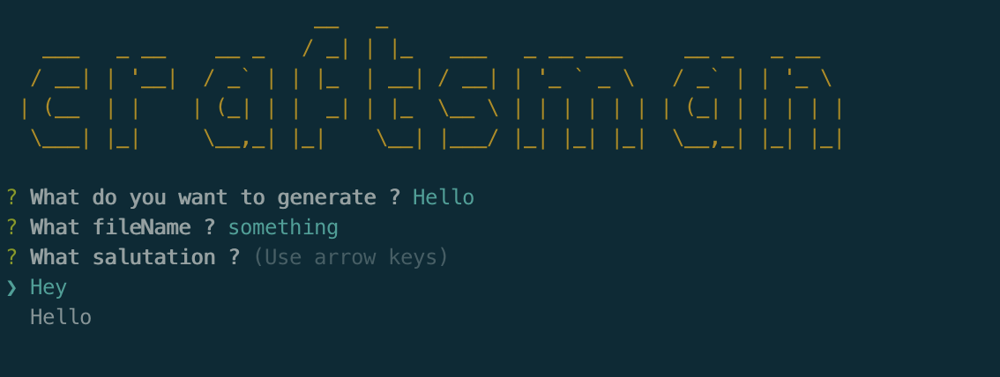
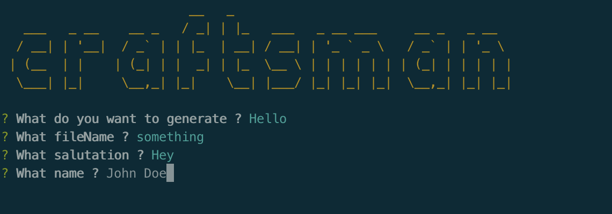
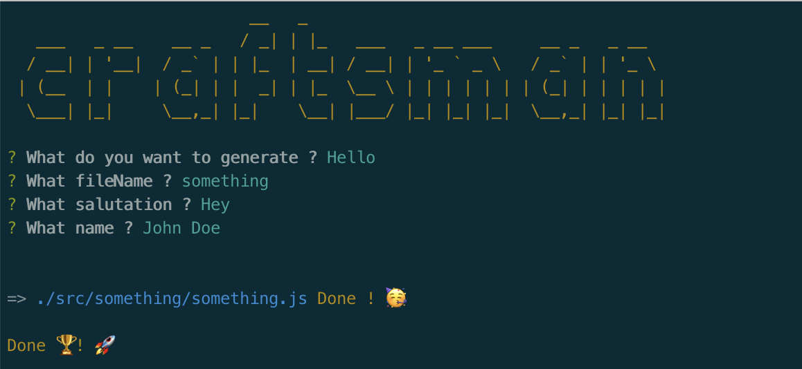
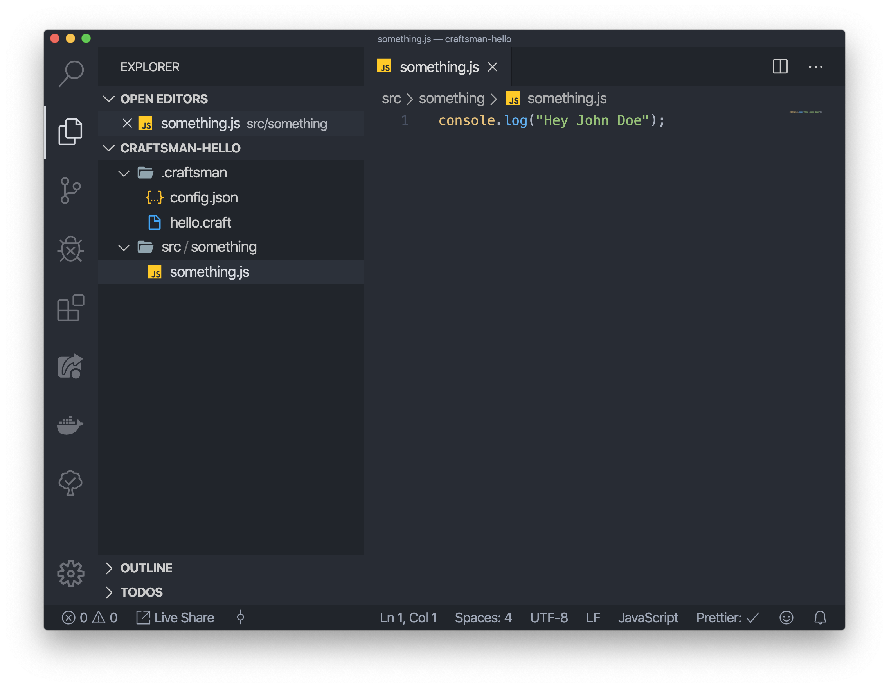

# Craftsman



## What is craftsman ?

Craftsman is CLI tool that helps you to simplify the process of creating code files by using templates.
It's a simple way to make conventions on how a file must look like.

## Installation

```bash
# Install craftsman
npm i @augustindlt/craftsman
```

### Config

Create a config file inside your project : `.craftsman/config.json`

Config parameters :

| parameter | type       | meaning               |
| --------- | ---------- | --------------------- |
| templates | Template[] | List of all templates |

**Template :**

| parameter | type                                  | meaning                                       |
| --------- | ------------------------------------- | --------------------------------------------- |
| type      | string                                | Name of the template                          |
| files     | File[]                                | List of all the files to generate             |
| variables | { [name:string]: "text" \| string[] } | Set of variables you need to create the files |

**File :**

| parameter | type   | meaning                                                 |
| --------- | ------ | ------------------------------------------------------- |
| path      | string | Destination of the generated file                       |
| name      | string | Name of the generated file                              |
| template  | string | File name without extension which contains the template |

**Variables :**

There are two types of variables : `"text"` or `string[]

`text` : Will ask you to enters a string value

`string[]` : Will ask you to choose between options

You can use variables inside the config or in the templates by writing : `#{nameOfMyVariable}#`

### Template

Create a template file inside your project : `.craftsman/nameOfMyTemplate.craft`

Put inside this file the code you want to generate.

## Usage

Inside your terminal :

```bash
cd path/to/your/project
craft
```

## Example

**Config :**

`.craftsman/config.json` :

```json
{
  "templates": [
    {
      "type": "Hello",
      "files": [
        {
          "path": "./src/#{fileName}#",
          "name": "#{fileName}#.js",
          "template": "hello"
        }
      ],
      "variables": {
        "fileName": "text",
        "salutation": ["Hey", "Hello"],
        "name": "text"
      }
    }
  ]
}
```

`.craftsman/hello.craft` :

```
console.log("#{salutation}# #{name}#");
```

**Usage :**

Inside the terminal :

```bash
craft
```

Enters all variables that we defined in the config :






After is done ! :



We can see the result :


